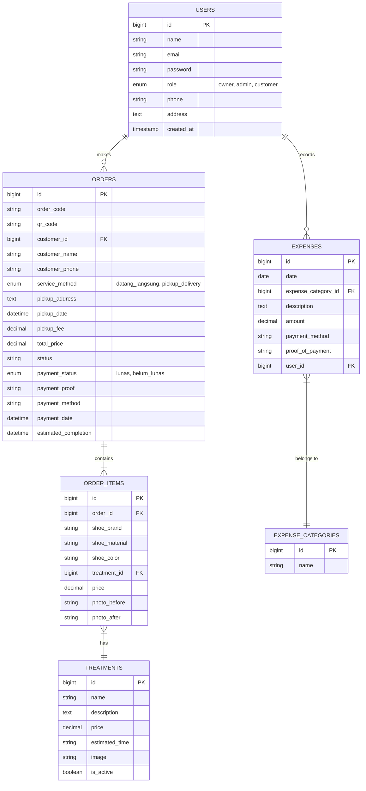

# Technical Database Schema (ERD)

This document provides a technical map of the CLEANSETZ SHOE CARE database, including entity relationships and field descriptions.

## Mermaid ERD (Crow's Foot Notation)

---

## Entity Descriptions

### 1. Users
Stores information for all actors (Owners, Admins, and Customers). The `role` column determines dashboard access and permissions.

### 2. Treatments (Services)
The catalog of shoe care services. Each treatment has a price and estimated processing time.

### 3. Orders
The main transaction record. It tracks the customer, service method, logistics details (address/fee), and payment confirmation.

### 4. Order Items (Shoes)
Represents the individual pairs of shoes within an order. Each item is linked to a specific treatment.

### 5. Expenses
Tracks operational spending. Each record is categorized and linked to the Admin who entered the data.

### 6. Expense Categories
A lookup table for organizing expenses (e.g., Supplies, Utilities, Rent).
